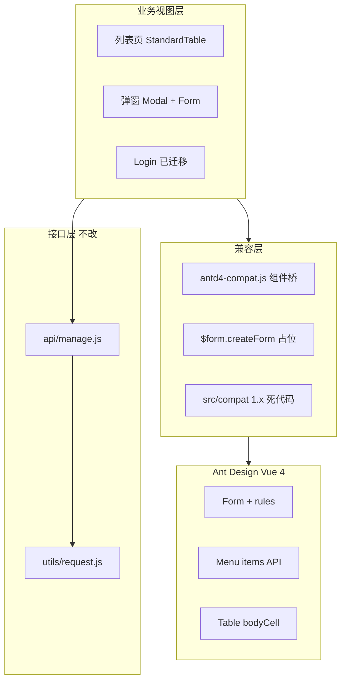
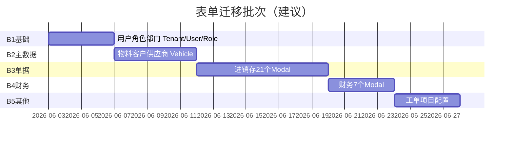

# Ant Design Vue 4 验证问题修复计划与实施步骤

| 文档属性 | 说明 |
| --- | --- |
| 版本 | v1.0 |
| 日期 | 2026-06-02 |
| 分支基线 | `feature/vue3.0` |
| 关联文档 | [12-AntDesignVue4升级实施步骤.md](./12-AntDesignVue4升级实施步骤.md)、[14-AntDesignVue4文档13实施变更审核台账.md](./14-AntDesignVue4文档13实施变更审核台账.md)（**实施变更审核，实施后必更**）、[ANTDV4_MIGRATION_STATUS.md](./jshERP-web/docs/ANTDV4_MIGRATION_STATUS.md) |
| 约束 | **不改变页面业务逻辑、整体布局与后端接口契约**；仅做 UI 层/API 适配 |

---

## 1. 文档目的与适用范围

本文档从高级前端工程视角，对当前 `jshERP-web` 在 **Vue 3.5 + `@vue/compat` + ant-design-vue 4.2.6** 条件下的验证问题进行归纳，并给出**分阶段、可回滚、可验收**的修复计划。

**适用范围：**

- 前端仓库：`jshERP-web/`
- 不涉及后端 `jshERP-boot` 接口路径、请求体字段、响应结构变更
- 不调整 Jeecg 业务规则（权限、单据状态机、计算逻辑）

**不在本文档范围内（明确排除）：**

- 视觉改版、主题重设计、布局模式变更（侧栏宽度、顶栏结构等保持 `GlobalLayout` / `defaultSettings` 现状）
- 后端 Flyway、数据库、Redis 等基础设施
- `jshERP-web-v3` 独立工程

---

## 2. 约束原则（必须遵守）

### 2.1 业务与布局不变

| 维度 | 要求 | 验证方式 |
| --- | --- | --- |
| 页面流程 | 列表 → 查询 → 新增/编辑 → 保存 → 审核等业务步骤不变 | 用例对照原 Vue2 版本 |
| 布局结构 | `GlobalLayout` 侧栏 + 顶栏 + `TabLayout` 多页签结构不变 | 截图对比 + 响应式断点检查 |
| 样式观感 | 允许 AntD4 默认间距/圆角微差，**禁止**改动 `labelCol`/`wrapperCol` 栅格比例除非修复遮挡 | 设计走查 |
| 路由与权限 | `permission.js`、`hasPermission`、菜单 `meta` 逻辑不变 | 不同角色账号回归 |

### 2.2 后端接口契约不变

所有修复仅发生在 **视图层与组件绑定层**，以下必须保持：

```text
请求入口：src/api/manage.js（getAction / postAction / putAction / httpAction）
请求封装：src/utils/request.js（axios、Token、租户头）
业务 URL：各 Vue 文件内原有路径，例如 /user/addUser、/depotHead/addDepotHeadAndDetail
请求体字段名：与 save 时 `values` / `formData` 对象 key 完全一致
```

**表单迁移时唯一允许的数据层改动：** 将 `validateFields` 回调中的 `values` 改为从 `formModel` 读取，但 **提交给 `httpAction` 的字段名与类型不得改变**。

示例（UserModal 保存逻辑语义保持不变）：

```javascript
// 修复前（语义）
this.form.validateFields((err, values) => {
  if (!err) {
    httpAction(url, values, method)
  }
})

// 修复后（语义等价）
this.$refs.formRef.validate().then(() => {
  httpAction(url, { ...this.formModel }, method)  // key 与原先 values 一致
})
```

### 2.3 技术栈基线（当前实测）

| 依赖 | 当前版本 | 说明 |
| --- | --- | --- |
| vue | 3.5.35 | 经 `@vue/compat`，MODE 2 |
| ant-design-vue | **4.2.6** | 已升级，`reset.css` |
| @ant-design/icons-vue | 7.0.1 | 经 `LegacyIcon` 映射 |
| 构建 | `npm run build` 可通过 | 不代表运行时无问题 |

---

## 3. 架构现状与问题分层



### 3.1 已具备能力

| 能力 | 实现位置 | 状态 |
| --- | --- | --- |
| 登录表单 v-model | `views/user/Login.vue` | 可用 |
| 图标兼容 | `components/legacy/LegacyIcon.vue` | 可用 |
| 输入/选择/日期 v-model 桥接 | `utils/antd4-compat.js` | 部分可用 |
| Modal `visible` → `open` | `CompatModal` | 桥接已做，需逐页验证 |
| Table `scopedSlots` → `customRender` | `CompatTable` | 列配置式列表依赖此桥 |
| 全局 AntD 注册 | `main.js` → `app.use(Antd)` | 已切换 4.x |

### 3.2 关键缺陷（验证问题根因）

#### P0-1：旧表单体系未迁移（最严重）

- **规模**：**56 个文件**仍含 `v-decorator`；**20 个单据/财务弹窗**继承 `JEditableTableMixin`（内部 `Form.create`）。
- **现状**：`installAntd4Compat` 中 `createLegacyForm()` 为占位实现，`v-decorator` 为空指令，**不绑定数据、不校验**。
- **影响**：系统管理、物料、单据、财务等新增/编辑弹窗可能保存空数据或校验失效。
- **典型文件**：`views/system/modules/UserModal.vue`、`views/material/modules/MaterialModal.vue`、`views/bill/modules/SaleOutModal.vue`。

#### P0-2：侧栏菜单仍按 AntD 1.x 子组件模式编写

- **文件**：`components/menu/index.js`（`SMenu`）、`components/menu/SideMenu.vue`。
- **现状**：`import Menu from 'ant-design-vue/es/menu'`，JSX 使用 `Menu.Item` / `SubMenu` + `vModel={selectedKeys}`。
- **AntD4 变化**：推荐 `items` 配置或 `v-model:selectedKeys` / `v-model:openKeys`；子组件 API 已变。
- **影响**：侧栏空白、无法展开子菜单、路由高亮异常。

#### P0-3：注册/改密等待迁移页面

- **文件**：`views/user/Register.vue`（`a-form-model` + 旧字段）、`components/tools/UserPassword.vue`。
- **影响**：注册与密码修改流程不可用或字段丢失。

#### P1-1：Vue2 插槽语法残留

- **规模**：大量 `slot="xxx"`、`slot-scope`、`#` 未统一（约 **150+ 文件**涉及 `slot=` 或 `slot-scope`）。
- **影响**：表格自定义列、Modal footer、Input prefix 图标不显示或渲染警告。

#### P1-2：失效的 AntD 1.x compat 死代码

- **目录**：`src/compat/vc-menu-*`、`src/compat/vc-select-*`、`src/utils/antd-vue2-compat.js`。
- **现状**：`vue.config.js` **已无** 对应 webpack alias；AntD4 无 `vc-menu` / `vc-select` 内部路径。
- **影响**：误导维护者；`vnode-compat.js` 仍引用 `antd-vue2-compat`，但 `main.js` 未调用 patch。

#### P1-3：深层 `ant-design-vue/es/...` 引用

- **示例**：`components/table/index.js`（`T.props.pagination`）、`menu/SideMenu.vue`（`es/layout/Sider`）、`App.vue`（`es/locale/zh_CN`）。
- **影响**：运行时 `undefined` 或分页默认值异常。

#### P2：第三方 Vue2 生态

| 依赖 | 风险 |
| --- | --- |
| `viser-vue@2` | 首页/报表图表可能无法渲染 |
| `@tinymce/tinymce-vue@2` | 富文本编辑器 |
| `vue-draggable-resizable`、`vue-area-linkage` 等 | 局部组件需点检 |

---

## 4. 修复策略总览

采用 **「先保核心路径 → 再批量迁移 → 最后清理」**，避免一次性大爆炸：

```text
阶段 A  稳定骨架（布局/菜单/登录/注册）     ← 用户能进系统、能导航
阶段 B  表单体系分批迁移（按业务域）         ← 核心业务可录入
阶段 C  列表/表格/弹窗 API 统一            ← 列表与详情可用
阶段 D  公共组件与 Mixin 下沉              ← 降低重复劳动
阶段 E  清理死代码与文档、弱化 compat 依赖  ← 可维护
阶段 F  （可选）去除 @vue/compat           ← 长期目标
```

**与 [12-AntDesignVue4升级实施步骤.md](./12-AntDesignVue4升级实施步骤.md) 的对应关系：**

| 本文档阶段 | 原 12 文档阶段 |
| --- | --- |
| A | 阶段 2 收尾 + 菜单专项 |
| B | 阶段 3 表单迁移 |
| C | 阶段 1 + 阶段 4 |
| D | 公共组件（JEditableTable 等） |
| E | 阶段 5 清理 |
| F | 阶段 6 |

---

## 5. 阶段 A：稳定系统骨架（预计 3～5 人日）

### 5.1 目标

用户可登录、注册（若开启）、看到侧栏菜单并进入首页，**无运行时红屏**。

### 5.2 任务清单

| 序号 | 任务 | 文件/范围 | 实施要点 | 不改动的部分 |
| --- | --- | --- | --- | --- |
| A-1 | 重写侧栏菜单适配 AntD4 | `components/menu/index.js`、`SideMenu.vue` | 将 `permissionList` 转为 `items` 树；`selectedKeys`/`openKeys` 用 `v-model:selectedKeys`；保留 `onOpenChange`、外链 `window.open` 逻辑 | 菜单数据结构、`updateMenu` 路由匹配算法 |
| A-2 | 完成注册页表单迁移 | `views/user/Register.vue` | 参照 `Login.vue`：`formModel` + `rules` + `a-form ref` | 注册 API 字段（租户名、登录名等） |
| A-3 | 完成改密弹窗 | `components/tools/UserPassword.vue` | 同上 | 改密接口 URL 与参数 |
| A-4 | 验证布局壳层 | `GlobalLayout.vue`、`TabLayout.vue`、`UserLayout.vue` | `a-drawer` 的 `:visible` 经 CompatModal 或改为 `:open`；移动端抽屉宽度保持 150px | `paddingLeft` 计算公式、主题 class |
| A-5 | 验证头部搜索 Select | `components/tools/UserMenu.vue` | 确认 `a-select` / `optionFilterProp` 在 CompatSelect 下可过滤；必要时 `option-label-prop="label"` | `searchMenus` 递归逻辑、`permissionMenuList` |
| A-6 | 更新迁移状态文档 | `jshERP-web/docs/ANTDV4_MIGRATION_STATUS.md` | 与 package.json 4.2.6 一致 | — |

### 5.3 验收用例（阶段 A）

| 编号 | 步骤 | 预期 |
| --- | --- | --- |
| A-T1 | 访问登录页，输入账号密码登录 | 进入首页，无 overlay 报错 |
| A-T2 | 展开/收起侧栏子菜单，点击菜单项 | 路由跳转正确，`selectedKeys` 高亮 |
| A-T3 | 点击头部搜索，输入菜单名 | 下拉过滤正常，选中后跳转 |
| A-T4 | 注册租户（若配置开启） | 提交成功，字段与后端一致 |
| A-T5 | 修改密码 | 校验规则生效，接口成功 |

---

## 6. 阶段 B：表单体系分批迁移（预计 15～25 人日）

### 6.1 迁移标准模板（单弹窗）

**原则：** 仅替换表单绑定方式；`labelCol`/`wrapperCol`、`validatorRules` 规则语义、`httpAction` 调用保持不变。

#### 6.1.1 改造前（AntD 1.x 典型）

```vue
<a-form :form="form">
  <a-form-item label="登录名称" :labelCol="labelCol" :wrapperCol="wrapperCol">
    <a-input v-decorator.trim="['loginName', validatorRules.loginName]" />
  </a-form-item>
</a-form>

<script>
export default {
  data() {
    return {
      form: this.$form.createForm(this),
      validatorRules: { loginName: { rules: [{ required: true, message: '请输入' }] } }
    }
  },
  methods: {
    edit(record) {
      this.form.resetFields()
      this.model = Object.assign({}, record)
      this.$nextTick(() => {
        this.form.setFieldsValue(pick(this.model, 'loginName', ...))
      })
    },
    handleOk() {
      this.form.validateFields((err, values) => {
        if (!err) {
          httpAction(this.url, values, this.method)
        }
      })
    }
  }
}
</script>
```

#### 6.1.2 改造后（AntD 4 推荐）

```vue
<a-form ref="formRef" :model="formModel" :rules="formRules">
  <a-form-item label="登录名称" name="loginName" :labelCol="labelCol" :wrapperCol="wrapperCol">
    <a-input v-model:value="formModel.loginName" />
  </a-form-item>
</a-form>

<script>
export default {
  data() {
    return {
      formModel: {},
      formRules: {
        loginName: [{ required: true, message: '请输入', trigger: 'blur' }]
      }
    }
  },
  methods: {
    edit(record) {
      this.$refs.formRef?.resetFields()
      this.model = Object.assign({}, record)
      this.formModel = pick(this.model, 'loginName', ...)
    },
    handleOk() {
      this.$refs.formRef.validate().then(() => {
        const values = { ...this.formModel }
        // 此处 values 的 key 必须与改造前完全一致
        httpAction(this.url, values, this.method)
      }).catch(() => {})
    }
  }
}
</script>
```

#### 6.1.3 规则转换对照

| 旧 `validatorRules` | 新 `formRules` |
| --- | --- |
| `{ rules: [{ required: true, message: 'x' }] }` | `[{ required: true, message: 'x', trigger: 'blur' }]` |
| `{ rules: [{ pattern: /.../, message: 'x' }] }` | `[{ pattern: /.../, message: 'x' }]` |
| `{ initialValue: x }` | 在 `edit()`/`add()` 时写入 `formModel` |
| `v-decorator.trim` | `v-model:value` + 提交前 `trim()` 或 input `@blur` |

### 6.2 分批迁移顺序（按业务风险与依赖）



#### 批次 B1：系统管理基础（约 18 个文件）

| 文件 | v-decorator 约数 | 备注 |
| --- | ---: | --- |
| `views/system/modules/UserModal.vue` | 11 | 高频，优先 |
| `views/system/modules/RoleModal.vue` | — | 使用 a-form-model，走 CompatFormModel |
| `views/system/modules/CustomerModal.vue` | 15 | |
| `views/system/modules/VendorModal.vue` | 15 | |
| `views/system/modules/DepotModal.vue` | 7 | |
| `views/system/modules/OrganizationModal.vue` | 5 | |
| `views/system/modules/TenantModal.vue` | 6 | |
| `views/system/modules/AccountModal.vue` | 5 | |
| `views/system/modules/UnitModal.vue` | 7 | |
| `views/system/modules/MemberModal.vue` | 7 | |
| `views/system/modules/FunctionModal.vue` | 8 | |
| `views/system/modules/DictDataModal.vue` | 8 | |
| `views/system/SystemConfigList.vue` | 7 | 内嵌表单 |
| `views/system/OptionList.vue` | 9 | |
| `views/system/OrganizationList.vue` | 5 | 树+表单 |
| `views/material/MaterialCategoryList.vue` | 5 | |
| `views/project/ProjectCategoryList.vue` | 5 | |

#### 批次 B2：主数据弹窗（约 8 个文件）

| 文件 | 备注 |
| --- | --- |
| `views/material/modules/MaterialModal.vue` | 字段多，23 处 decorator |
| `views/vehicle/modules/VehicleModal.vue` | 35 处，最复杂 |
| `views/material/modules/MaterialCategoryModal.vue` | |
| `views/material/modules/BatchSetInfoModal.vue` | |
| `views/project/modules/ProjectModal.vue` | |

#### 批次 B3：单据弹窗（21 个文件，含 JEditableTableMixin）

**共性：** 主表 `v-decorator` + 明细 `JEditableTable`；保存逻辑在 `handleOk` → `validateFormAndTables`。

| 文件 |
| --- |
| `views/bill/modules/PurchaseInModal.vue` |
| `views/bill/modules/PurchaseOrderModal.vue` |
| `views/bill/modules/PurchaseBackModal.vue` |
| `views/bill/modules/PurchaseApplyModal.vue` |
| `views/bill/modules/SaleOutModal.vue` |
| `views/bill/modules/SaleOrderModal.vue` |
| `views/bill/modules/SaleBackModal.vue` |
| `views/bill/modules/RetailOutModal.vue` |
| `views/bill/modules/RetailBackModal.vue` |
| `views/bill/modules/OtherInModal.vue` |
| `views/bill/modules/OtherOutModal.vue` |
| `views/bill/modules/AllocationOutModal.vue` |
| `views/bill/modules/AssembleModal.vue` |
| `views/bill/modules/DisassembleModal.vue` |
| `views/bill/dialog/ManyAccountModal.vue` |
| `views/bill/dialog/QuickEditModal.vue` |
| `views/bill/dialog/BatchSetDepot.vue` |
| `views/bill/dialog/BillDetail.vue` | 详情+编辑混合，单独评估 |

**单据迁移特别注意（接口不变）：**

1. `JEditableTableMixin.js` 中 `form: this.$form.createForm(this)` 需改为各弹窗自有 `formRef`，或 **阶段 D** 统一升级 Mixin。
2. `validateFormAndTables(this.form, this.refKeys)` 改为 AntD4 校验 + 子表 `getValues` 逻辑不变。
3. 提交前组装 `formData` 的字段名（如 `depotHead`、`depotItem` JSON 字符串）**禁止改名**。

#### 批次 B4：财务（7 个 Modal）

`AdvanceInModal`、`MoneyInModal`、`MoneyOutModal`、`ItemInModal`、`ItemOutModal`、`GiroModal`、`financial/dialog/FinancialDetail.vue`。

#### 批次 B5：工单与其它

`workorder/modules/WorkOrderModal.vue`、`project/modules/ProjectCategoryModal.vue`、各类 iframe 内嵌表单（`BillExcelIframe`、`WorkflowIframe` 等，低优先级）。

### 6.3 每文件完成定义（DoD）

- [ ] 无 `v-decorator`、无 `:form="form"`、无 `Form.create`
- [ ] 新增/编辑/校验失败/保存成功/关闭重开 5 项通过
- [ ] Network 面板请求 body 与迁移前 diff 仅允许空值差异修复，**无字段名变化**
- [ ] `npm run build` 通过
- [ ] 本文件已加入模块回归清单（见第 9 节）

---

## 7. 阶段 C：列表、表格与弹窗 API（预计 8～12 人日）

### 7.1 目标

在不改列定义业务含义的前提下，使列表页分页、排序、操作列、弹窗开关与 AntD4 一致。

### 7.2 任务清单

| 序号 | 任务 | 范围 | 实施要点 |
| --- | --- | --- | --- |
| C-1 | 统一 Modal 开关属性 | 全站 `:visible` | 优先依赖 `CompatModal`；新改文件可直接 `v-model:open` |
| C-2 | 表格插槽迁移 | 含 `slot-scope` 的列表页 | 模板改为 `#bodyCell="{ column, record, index }"` 或继续依赖 `CompatTable` + columns `scopedSlots` |
| C-3 | 修复 `StandardTable` | `components/table/index.js` | 分页配置改为 AntD4 `pagination` 对象字面量，勿依赖 `T.props.pagination` |
| C-4 | Input 前缀插槽 | `Login.vue` 等 | `slot="prefix"` → `#prefix` |
| C-5 | Drawer 适配 | `GlobalLayout.vue` | `:visible` → `:open`（若 Compat 未覆盖 Drawer，单独包装） |
| C-6 | 下拉/树选择 | `a-tree-select`、`a-select` | 确认 `dropdownMatchSelectWidth` 等等价属性在 4.x 中名称 |

### 7.3 列表页优先回归清单（高频）

| 模块 | 代表文件 |
| --- | --- |
| 用户管理 | `views/system/UserList.vue` |
| 商品管理 | `views/material/MaterialList.vue` |
| 销售出库 | `views/bill/SaleOutList.vue` |
| 采购入库 | `views/bill/PurchaseInList.vue` |
| 工单 | `views/workorder/WorkOrderList.vue` |
| 首页图表 | `views/dashboard/IndexChart.vue`（viser-vue 专项） |

---

## 8. 阶段 D：公共能力下沉（预计 5～8 人日）

### 8.1 升级 `JEditableTableMixin`

**文件：** `src/mixins/JEditableTableMixin.js`

| 改动点 | 说明 |
| --- | --- |
| 移除 `form: this.$form.createForm(this)` | 改为要求子组件提供 `formRef` / `formModel` |
| `edit(record)` | `resetFields` → `formRef.resetFields()`；`setFieldsValue` → 赋值 `formModel` |
| `handleOk` | 调用 `validateFormAndTables` 的 AntD4 版本（需在 `JEditableTableUtil.js` 适配） |
| 不改 | `getAllTable`、`eachAllTable`、`httpAction` 调用方式 |

### 8.2 评估 `JEditableTable.vue`

- 明细表内部大量 `slot`、`v-model` 混用，单独排期。
- 验收：增删行、计算列、仓库选择弹窗、提交 `{ rows }` 结构不变。

### 8.3 可选：表单迁移辅助 composable

新建 `composables/useLegacyFormBridge.js`（命名示例）：

- 输入：`validatorRules`（旧格式）
- 输出：`formRules` + `initFormModel(record, fields)`
- **目的**：减少 56 个文件重复劳动，不改变对外行为。

---

## 9. 阶段 E：清理与文档（预计 2～3 人日）

| 序号 | 任务 | 说明 |
| --- | --- | --- |
| E-1 | 删除或归档 `src/compat/vc-menu-*`、`vc-select-*` | AntD4 下无效 |
| E-2 | 删除 `src/utils/antd-vue2-compat.js` | 确认无引用后 |
| E-3 | 精简 `antd4-compat.js` | 表单迁移完成后移除 `createLegacyForm` 与空 `v-decorator` |
| E-4 | 同步文档 | `ANTDV4_MIGRATION_STATUS.md`、本计划执行勾选 |
| E-5 | 更新 `12-AntDesignVue4升级实施步骤.md` 阶段状态 | 标注已完成/跳过项 |

---

## 10. 阶段 F：去除 `@vue/compat`（可选，预计 5～10 人日）

**前置条件：** 阶段 A～E 完成；控制台无 compat 相关 warning；`v-decorator` 清零。

| 步骤 | 操作 |
| --- | --- |
| F-1 | 移除 `vue.config.js` 中 `vue -> @vue/compat` |
| F-2 | 删除依赖 `@vue/compat` |
| F-3 | 修复编译期/运行期 API 差异（如 `filters`、`$listeners`） |
| F-4 | 全量回归第 9 节清单 |

---

## 11. 接口与数据契约检查表（每个弹窗必做）

迁移完成后，对每次保存操作执行：

| 检查项 | 方法 |
| --- | --- |
| URL 不变 | diff 迁移前后 `httpAction` 第一个参数 |
| HTTP 方法不变 | `post` / `put` 不变 |
| Content-Type | 仍为 `application/json`（除非原为 form-data） |
| 请求体字段 | Chrome DevTools → Payload，与旧版逐项对比 |
| 数组/明细 | `depotItem`、`rows` 等 JSON 字符串格式不变 |
| 响应处理 | `then(res => { if(res.code===200)... })` 逻辑不变 |

---

## 12. 全站回归测试清单

### 12.1 冒烟（每次合并前）

1. 登录 / 退出  
2. 侧栏导航 3 级菜单  
3. 头部菜单搜索  
4. 打开/关闭 3 个不同类型弹窗（系统/物料/单据）  
5. 列表查询 + 分页 + 重置  

### 12.2 模块回归（阶段 B 各批次后）

| 模块 | 核心操作 |
| --- | --- |
| 系统管理 | 用户 CRUD、角色授权、部门树 |
| 商品 | 物料 CRUD、分类、属性 |
| 采购 | 订单 → 入库 → 退货 链路 |
| 销售 | 订单 → 出库 → 退货 链路 |
| 财务 | 收款/付款单录入 |
| 工单 | 工单新建、项目选择、车辆选择 |
| 报表 | 库存、往来账查询（含图表） |

### 12.3 非功能

| 项 | 标准 |
| --- | --- |
| 构建 | `npm run build` 成功 |
| 控制台 | 无红色 Error（允许 Sass 弃用 warning） |
| 性能 | 首屏与列表加载无明显劣化 |

---

## 13. 风险矩阵与应对

| 风险 | 概率 | 影响 | 应对 |
| --- | --- | --- | --- |
| 表单字段遗漏导致静默丢字段 | 高 | 高 | 提交前 console 对比 + 接口 diff；必填项用例 |
| JEditableTable 行为差异 | 中 | 高 | 单独排期；先迁主表再迁明细 |
| 菜单 items 转换错误 | 中 | 高 | 用真实 `permissionList` 数据快照测试 |
| viser 图表不可用 | 中 | 中 | 保留原页面布局，图表区替换为 ECharts/@antv/g2plot |
| 迁移周期过长 | 中 | 中 | 严格按批次交付，每批可独立上线 |
| compat 与 AntD4 双轨导致诡异 bug | 中 | 中 | 阶段 E 尽快移除 stub |

---

## 14. 回滚策略

| 粒度 | 方式 |
| --- | --- |
| 单文件 | Git revert 该文件 PR |
| 单阶段 | 回退到阶段开始前 tag，例如 `antd4-phase-A-done` |
| 全量 | 回退提交 `2ab23987`（AntD 1.x compat 基线）或 `feature/vue3.0` 上升级前节点 |

**建议：** 每完成一个阶段打 tag，并在 `ANTDV4_MIGRATION_STATUS.md` 记录 tag 名。

---

## 15. 人力与工期估算（参考）

| 阶段 | 内容 | 人日（1 名高级前端） |
| --- | --- | ---: |
| A | 骨架稳定 | 3～5 |
| B | 表单 56 文件 | 15～25 |
| C | 列表/弹窗 API | 8～12 |
| D | 公共 Mixin/表格 | 5～8 |
| E | 清理 | 2～3 |
| F | 去 compat（可选） | 5～10 |
| **合计** | | **38～63** |

若 2 人并行：B/C 可交叉（一人表单、一人列表），总日历时间约 **4～8 周**（含回归）。

---

## 16. 交付物清单

| 交付物 | 路径 |
| --- | --- |
| 本修复计划 | `13-AntDesignVue4验证问题修复计划与实施步骤.md`（仓库根目录） |
| 迁移状态看板 | `jshERP-web/docs/ANTDV4_MIGRATION_STATUS.md`（持续更新） |
| 原总体方案 | `12-AntDesignVue4升级实施步骤.md` |
| 模块回归记录（建议新建） | `jshERP-web/docs/ANTDV4_REGRESSION_CHECKLIST.md` |

---

## 17. 附录 A：`v-decorator` 待迁移文件完整列表（56）

以下路径均相对于 `jshERP-web/src/`。

```text
components/tools/BillExcelIframe.vue
components/tools/WorkflowIframe.vue
views/bill/dialog/BatchSetDepot.vue
views/bill/dialog/BillDetail.vue
views/bill/dialog/BillPrintIframe.vue
views/bill/dialog/BillPrintProIframe.vue
views/bill/dialog/ManyAccountModal.vue
views/bill/dialog/QuickEditModal.vue
views/bill/modules/AllocationOutModal.vue
views/bill/modules/AssembleModal.vue
views/bill/modules/DisassembleModal.vue
views/bill/modules/OtherInModal.vue
views/bill/modules/OtherOutModal.vue
views/bill/modules/PurchaseApplyModal.vue
views/bill/modules/PurchaseBackModal.vue
views/bill/modules/PurchaseInModal.vue
views/bill/modules/PurchaseOrderModal.vue
views/bill/modules/RetailBackModal.vue
views/bill/modules/RetailOutModal.vue
views/bill/modules/SaleBackModal.vue
views/bill/modules/SaleOrderModal.vue
views/bill/modules/SaleOutModal.vue
views/financial/dialog/FinancialDetail.vue
views/financial/modules/AdvanceInModal.vue
views/financial/modules/GiroModal.vue
views/financial/modules/ItemInModal.vue
views/financial/modules/ItemOutModal.vue
views/financial/modules/MoneyInModal.vue
views/financial/modules/MoneyOutModal.vue
views/material/MaterialCategoryList.vue
views/material/modules/BatchSetInfoModal.vue
views/material/modules/BatchSetPriceModal.vue
views/material/modules/BatchSetStockModal.vue
views/material/modules/MaterialAttributeModal.vue
views/material/modules/MaterialCategoryModal.vue
views/material/modules/MaterialModal.vue
views/material/modules/MaterialPropertyModal.vue
views/project/ProjectCategoryList.vue
views/project/modules/ProjectCategoryModal.vue
views/project/modules/ProjectModal.vue
views/system/OrganizationList.vue
views/system/OptionList.vue
views/system/SystemConfigList.vue
views/system/modules/AccountModal.vue
views/system/modules/CustomerModal.vue
views/system/modules/DepotModal.vue
views/system/modules/DictDataModal.vue
views/system/modules/FunctionModal.vue
views/system/modules/MemberModal.vue
views/system/modules/OrganizationModal.vue
views/system/modules/TenantModal.vue
views/system/modules/UnitModal.vue
views/system/modules/UserModal.vue
views/system/modules/VendorModal.vue
views/vehicle/modules/VehicleModal.vue
views/workorder/modules/WorkOrderModal.vue
```

另：`views/user/Register.vue`、`components/tools/UserPassword.vue` 使用 `a-form-model`，纳入阶段 A，未计入上表。

---

## 18. 附录 B：继承 `JEditableTableMixin` 的弹窗（20，不含 mixin 自身）

```text
views/bill/modules/OtherOutModal.vue
views/financial/modules/MoneyOutModal.vue
views/bill/modules/PurchaseInModal.vue
views/financial/modules/GiroModal.vue
views/financial/modules/AdvanceInModal.vue
views/bill/modules/AssembleModal.vue
views/bill/modules/PurchaseOrderModal.vue
views/bill/modules/SaleOutModal.vue
views/financial/modules/ItemInModal.vue
views/bill/modules/PurchaseApplyModal.vue
views/bill/modules/DisassembleModal.vue
views/bill/modules/AllocationOutModal.vue
views/bill/modules/PurchaseBackModal.vue
views/bill/modules/OtherInModal.vue
views/bill/modules/RetailBackModal.vue
views/financial/modules/ItemOutModal.vue
views/bill/modules/RetailOutModal.vue
views/financial/modules/MoneyInModal.vue
views/bill/modules/SaleOrderModal.vue
views/bill/modules/SaleBackModal.vue
```

---

## 19. 附录 C：`antd4-compat.js` 已包装组件一览

| 全局组件名 | 桥接能力 |
| --- | --- |
| AForm / AFormItem | 透传 |
| AModal | visible → open |
| AInput / AInputPassword / ATextarea | value ↔ modelValue |
| ASelect / AInputNumber / ADatePicker / ARangePicker / ATreeSelect | 同上 |
| ASwitch / ACheckbox / ARadioGroup | checked ↔ modelValue |
| ATable | scopedSlots.customRender → customRender |
| ATooltip / ADropdown / APopover | visible → open |
| AFormModel / AFormModelItem | 桥到 Form + name |
| $form.createForm | **占位（阶段 B 后删除）** |
| v-decorator | **空指令（阶段 B 后删除）** |

---

## 20. 修订记录

| 版本 | 日期 | 说明 |
| --- | --- | --- |
| v1.0 | 2026-06-02 | 初版：基于 feature/vue3.0 代码审查与验证问题归纳 |
| v1.1 | 2026-06-02 | 文档移至仓库根目录，与 09～12 系列方案对齐 |
| v1.2 | 2026-06-02 | 关联 14 号实施变更审核台账；实施变更与计划分离 |

---

**说明：** 本文档仅描述计划与步骤，不包含代码修改。实施时请以实际分支 diff 为准，并完成第 11、12 节检查后再合并主干。  
**实施变更记录：** 所有按本文档落地的代码修改须同步记入 [14-AntDesignVue4文档13实施变更审核台账.md](./14-AntDesignVue4文档13实施变更审核台账.md)，供审核与回归对照。
